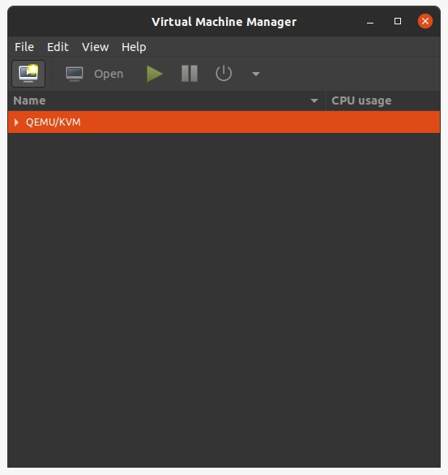

## Máquina virtual

La máquina virtual elegida por defecto es Virt-Manager

### Instalación (Linux)

1. Instalar Virtual Manager desde la [página oficial][virt-manager download].

```bash
sudo apt-get install virt-manager
```

2. Reiniciar la PC

---

## Imagen de disco de FreeBSD

La imágen utilizada corresponde con la versión utilizada en el trabajo integrador de referencia, esta es [FreeBSD 11.0].

---

## Instalación del SO

1. Abrir la máquina virtual instalada, y hacer click en el ícono para crear una nueva máquina virtual.

   

2. Hacer click en la opción para instalar la máquina desde un archivo local (ISO) y luego importar la imagen de disco desde la ubicación en donde fue guardada previamente.

   

3. Elegir la cantidad de memoria y procesadores para asignarle a la máquina. Intentar que la cantidad de procesadores sea como mínimo dos.

   

4. Asignar la cantidad de espacio en disco deseada.

   

5. Elegir el nombre que tendrá la instancia y en caso de querer revisar las configuraciones antes de comenzar la instalación, clickear el checkbox correspondiente.

   

6. Una vez terminadas las configuraciones, se iniciará una nueva ventana con la pantalla de inicio de FreeBSD. Es posible apretar Enter o dejar pasar 8 segundos para que comience la guía de instalación.

   

[Paso a paso](https://computingforgeeks.com/how-to-install-freebsd-on-kvm-virtualbox/)

---

## QEMU VM

```bash
# First time to install the OS
qemu-system-x86_64 -m 2G -smp 4 -cdrom FreeBSD-13.1-RELEASE-amd64-disc1.iso -hda freebsd-13.1.0-amd64.qcow2 -boot d

# After the OS is installed for running the VM
qemu-system-x86_64 \
-m 2G \
-smp 4 \
-hda freebsd-13.1.0-amd64.qcow2 \
-boot c \
-device e1000,netdev=net0 \
-netdev user,id=net0,hostfwd=tcp::5555-:22

# -m 2G \   # RAM
# -smp 4 \  # Number of processors
# -hda freebsd-13.1.0-amd64.qcow2 \ # Hard disk image
# -boot c \ # Boot from hard disk
# -device e1000,netdev=net0 \ # Creates a virtual e1000 network device
# -netdev user,id=net0,hostfwd=tcp::5555-:22 \  # Creates one user typed backend, forwarding local port 5555 to guest port 22
```

## Documentación

- [Imágen de disco FreeBSD 11.0][freebsd 11.0]
- [FTP FreeBSD de imágenes de disco][freebsd ftp]
- [Repositorio FreeBSD 11.0][freebsd repo]
- [Repositorio Nicolas Papp][nicolaspapp repo]

<!-- Global variables -->

[virt-manager download]: https://virt-manager.org/download/
[freebsd ftp]: http://ftp-archive.freebsd.org/pub/FreeBSD-Archive/old-releases/ISO-IMAGES/11.0/
[freebsd 11.0]: http://ftp-archive.freebsd.org/pub/FreeBSD-Archive/old-releases/ISO-IMAGES/11.0/FreeBSD-11.0-RELEASE-amd64-disc1.iso
[freebsd repo]: https://github.com/freebsd/freebsd-src/tree/releng/11.0
[nicolaspapp repo]: https://github.com/nicolaspapp/freebsd/tree/final-project
