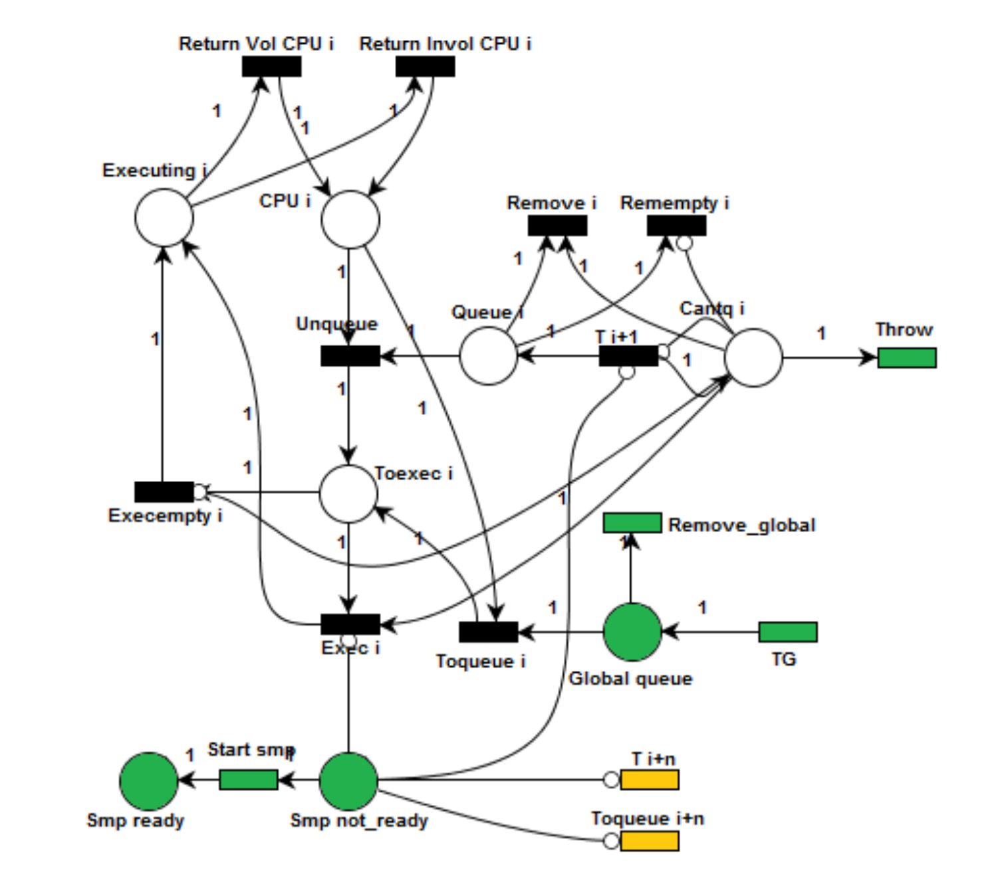

# Modelado del planificador a corto plazo con redes de Petri (resúmen)

## Modelado del hilo


- **T0**: El paso del estado INACTIVE a CAN RUN. Esto sucede cuando el hilo se agrega al scheduler. Esto sucede generalmente en momento de creación de un proceso o cuando el mismo realiza un fork. Esta tarea no corresponde al scheduler, por lo que inicialmente un hilo en el scheduler se encuentra inicializado en el estado CAN RUN. Esta transición nunca se dispara, solo se la incorpora al modelo de modo representativo.
- **T1**: El hilo se pone en una cola local de una determinada CPU o en la cola global dependiendo de la disponibilidad. Esta cola organiza los hilos de acuerdo a sus prioridades de ejecución.
- **T2**: El hilo se quita de la cola y pasa a ejecutar las instrucciones del programa que tiene asignadas. En este instante el procesador se encuentra ocupado por dicho hilo.
- **T3**: El scheduler interrumpe el hilo y lo vuelve a colocar en una cola. El planificador toma otro hilo de la cola (el de mayor prioridad) y realiza un cambio de contexto.
- **T4**: Algún evento, semáforo o espera bloquea al hilo. Se agrega en una sleepq o turnstile, en la cual el hilo queda a la espera de un evento que le quitará el bloqueo.
- **T5**: Se desbloquea el hilo y puede volver a encolarse nuevamente. El evento que lo desbloquea se genera fuera del scheduler. El hilo queda a la espera para poder cambiar de estado cuando corresponda.

### Correspondencia entre el nombre de las plazas del modelo con el nombre de las plazas en el código

| Modelo    | Código              |
| --------- | ------------------- |
| Inactive  | PLACE_INACTIVE      |
| Can_run   | PLACE_CAN_RUN       |
| Runq      | PLACE_CPU_RUN_QUEUE |
| Runninr   | PLACE_RUNNING       |
| Inhibited | PLACE_INHIBITED     |

---

### Archivos de interés

- Archivo [`proc.h`](../../migrations/11.0.0_PI/sys/sys/proc.h)

  > `mark`: vector que tiene el marcado inicial, con tamaño `PLACES_SIZE`.
  >
  > `sensitized_buffer`: vector que representa las transiciones sensibilizadas de su red asociada, con tamaño `TRANSITIONS_SIZE`.

  <details><summary><b style="cursor: pointer;">Ver código</b></summary>

  ```h
  ...
  #define PLACES_SIZE 5
  #define TRANSITIONS_SIZE 7
  ...

  struct thread {
  	struct mtx	*volatile td_lock; /* replaces sched lock */
  	struct proc	*td_proc;	/* (*) Associated process. */
  	TAILQ_ENTRY(thread) td_plist;	/* (*) All threads in this proc. */
  	TAILQ_ENTRY(thread) td_runq;	/* (t) Run queue. */
  ...
  	int mark[PLACES_SIZE];
  	int sensitized_buffer[TRANSITIONS_SIZE];
  };
  ```

  </details>

<br/>

- Archivo [`sched_petri.h`](../../migrations/11.0.0_PI/sys/sys/sched_petri.h)

  > `init_petri_thread`: esta función recibe un thread como parámetro y procede a inicializar su `mark` al marcado inicial.
  >
  > `thread_get_sensitized`: recibe un thread como parámetro y analiza todas sus transiciones para actualizar su `sensitized_buffer` (función no utilizada).
  >
  > `thread_petri_fire`: recibe un thread y una transición como parámetros y la dispara haciendo uso de la matriz de incidencia, actualizando finalmente su marcado.
  >
  > `thread_search_and_fire`: recibe un thread como parámetro y calcula sus transiciones sensibilizadas para proceder a dispararlas (función no utilizada).

  <details><summary><b style="cursor: pointer;">Ver código</b></summary>

  ```h
  #ifndef SCHED_PETRI_H
  #define SCHED_PETRI_H
  ...
  #include <sys/proc.h>
  ...

  //Petri thread Methods
  void init_petri_thread(struct thread *pt_thread);
  void thread_get_sensitized(struct thread *pt);
  __inline int thread_transition_is_sensitized(struct thread *pt, int transition_index);
  void thread_petri_fire(struct thread *pt, int transition);
  void thread_print_net(struct thread *pt);

  ...
  #endif
  ```

  </details>

<br/>

- Archivo [`sched_petri.c`](../../migrations/11.0.0_PI/sys/kern/sched_petri.c)

  > Se declara la matriz de incidencia (`matrix_Incidence`) y el vector de marcado inicial (`initial_mark`), y a su vez se implementan las funciones declaradas en `sched_petri.h`

  <details><summary><b style="cursor: pointer;">Ver código</b></summary>

  ```c
  #include <sys/sched_petri.h>

  /*
  GLOBAL VARIABLES
  */
  const int matrix_Incidence[PLACES_SIZE][TRANSITIONS_SIZE] = {
  	{-1,  0,  0,  0,  0,  0 ,  0},
  	{ 1, -1,  0,  1,  0,  1 ,  1},
  	{ 0,  1, -1,  0,  0,  0 , -1},
  	{ 0,  0,  1, -1, -1,  0 ,  0},
  	{ 0,  0,  0,  0,  1, -1 ,  0}
  };

  const int initial_mark[PLACES_SIZE] = { 0, 1, 0, 0, 0 };
  ...
  ```

  </details>

<br/>

- Archivo [`kern_thread.c`](../../migrations/11.0.0_PI/sys/kern/kern_thread.c)

  > Llamar a `init_petri_net(td)` para inicializar y asignar memoria para la red.

  <details><summary><b style="cursor: pointer;">Ver código</b></summary>

  ```c
  ...

  /*
  * Allocate a thread.
  */
  struct thread *
  thread_alloc(int pages)
  {
  	struct thread *td;

  	thread_reap(); /* check if any zombies to get */

  	td = (struct thread *)uma_zalloc(thread_zone, M_WAITOK);
  	KASSERT(td->td_kstack == 0, ("thread_alloc got thread with kstack"));
  	if (!vm_thread_new(td, pages)) {
  		uma_zfree(thread_zone, td);
  		return (NULL);
  	}
  	cpu_thread_alloc(td);
  	vm_domain_policy_init(&td->td_vm_dom_policy);
  	init_petri_thread(td);
  	return (td);
  }

  ...
  ```

  </details>

<br/>

---

## Modelado de la red de recursos



<details><summary><b style="cursor: pointer;">Ver red de recursos completa</b></summary>

</details>

---

### Archivos de interés

- Archivo [`sched_petri.h`](../../migrations/11.0.0_PI/sys/sys/sched_petri.h)

  > Se definen las instrucciones que van a representar las plazas y transiciones de la red de recursos
  >
  > Se trabajará con 4 CPUs
  >
  > Se define la estructura `petri_cpu_resource_net` con los siguientes campos:
  >
  > - `mark`: vector que contiene el marcado inicial de la red de recursos, con tamaño `CPU_NUMBER_PLACES`.
  > - `sensitized_buffer`: vector que representa las transiciones sensibilizadas, con tamaño `CPU_NUMBER_TRANSITIONS`.
  > - `cpu_owner_list`: vector con los identificadores de los threads que están utilizando cada CPU, con tamaño `CPU_NUMBER` (campo no utilizado).
  > - `incidence_matrix`: matriz de tamaño `CPU_NUMBER_PLACES` \* `CPU_NUMBER_TRANSITIONS`.
  > - `inhibition_matrix`: matriz de tamaño `CPU_NUMBER_PLACES` \* `CPU_NUMBER_TRANSITIONS`.
  > - `is_automatic_transition`: vector con las transiciones automáticas de la red, de tamaño `CPU_NUMBER_TRANSITIONS`.

    <details><summary><b style="cursor: pointer;">Ver código</b></summary>

  ```h
  #ifndef SCHED_PETRI_H
  #define SCHED_PETRI_H
  ...

  #define CPU_NUMBER 4
  // FOR GLOBAL TRANISTIONS
  #define CPU_BASE_PLACES 5
  #define CPU_BASE_TRANSITIONS 9
  #define CPU_NUMBER_PLACES (CPU_BASE_PLACES*CPU_NUMBER)+3
  #define CPU_NUMBER_TRANSITION (CPU_BASE_TRANSITIONS*CPU_NUMBER)+4
  /* Definitions of transition and places for the CPU resource net */
  //PLACES
  #define PLACE_CANTQ 0
  #define PLACE_QUEUE 1
  #define PLACE_CPU 2
  #define PLACE_TOEXEC 3
  #define PLACE_EXECUTING 4


  // Global queue independent of the number of CPUs
  #define PLACE_GLOBAL_QUEUE (CPU_NUMBER_PLACES-3)
  #define PLACE_SMP_NOT_READY (CPU_NUMBER_PLACES-2)
  #define PLACE_SMP_READY (CPU_NUMBER_PLACES-1)

  //TRANSITION
  #define TRAN_ADDTOQUEUE 0
  #define TRAN_UNQUEUE 1
  #define TRAN_EXEC 2
  #define TRAN_EXEC_EMPTY 3
  #define TRAN_RETURN_VOL 4
  #define TRAN_RETURN_INVOL 5
  #define TRAN_FROM_GLOBAL_CPU 6
  #define TRAN_REMOVE_QUEUE 7
  #define TRAN_REMOVE_EMPTY_QUEUE 8


  //Global transition
  #define TRAN_REMOVE_GLOBAL_QUEUE (CPU_NUMBER_TRANSITION-4)
  #define TRAN_START_SMP (CPU_NUMBER_TRANSITION-3)
  #define TRAN_THROW (CPU_NUMBER_TRANSITION-2)
  #define TRAN_QUEUE_GLOBAL (CPU_NUMBER_TRANSITION-1)


  struct petri_cpu_resource_net {
  	int mark[CPU_NUMBER_PLACES];
  	int sensitized_buffer[CPU_NUMBER_TRANSITION];
  	int cpu_owner_list[CPU_NUMBER];
  	char incidence_matrix[CPU_NUMBER_PLACES][CPU_NUMBER_TRANSITION];
  	char inhibition_matrix[CPU_NUMBER_PLACES][CPU_NUMBER_TRANSITION];
  	int is_automatic_transition[CPU_NUMBER_TRANSITION];
  };

  ...

  //Petri Global Methods
  void init_resource_net(void);
  void resource_get_sensitized(void);
  void resource_fire_net(struct thread *pt, int transition_index);
  int resource_choose_cpu(struct thread *td);
  void resource_expulse_thread(struct thread *td, int flags);
  void resource_execute_thread(struct thread *newtd, int cpu);
  void resource_remove_thread(struct thread *newtd, int cpu);
  void print_resource_net(void);
  void print_uni_label(void);

  #endif
  ```

    </details>

---

## Bibliografía

[Repositorio Nicolas Papp][nicolaspapp repo]

<!-- Global variables -->

[nicolaspapp repo]: https://github.com/nicolaspapp/freebsd/tree/final-project
