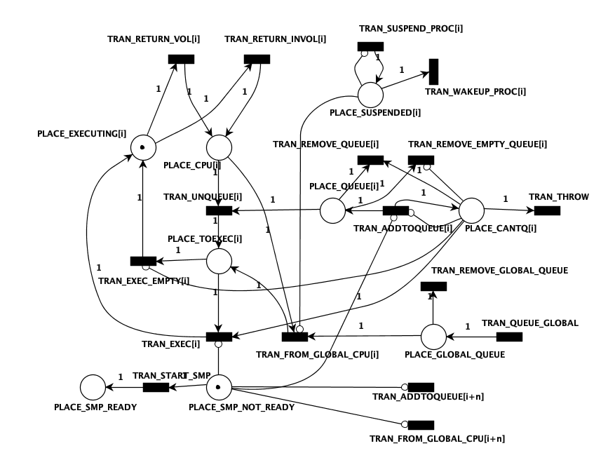

# Corrección de estados de un hilo en el modelo

> Modelar correctamente los cambios de estado de un hilo

## Análisis del modelo

Actualmente el modelado del hilo a través de la Red de Petri no es coherente con el funcionamiento original del sistema operativo.
Se propone observar los cambios de estado del hilo en el código e intentar replicar el comportamiento en el modelo.

## Implementación del modelo

Los estados del hilo presentes en el código son los siguientes:

- TDS_INACTIVE
- TDS_INHIBITED
- TDS_CAN_RUN
- TDS_RUNQ
- TDS_RUNNING

Los modificadores de estado son los siguientes:

```c
#define	TD_SET_INHIB(td, inhib) do {			\
	(td)->td_state = TDS_INHIBITED;			\
	(td)->td_inhibitors |= (inhib);			\
} while (0)

#define	TD_CLR_INHIB(td, inhib) do {			\
	if (((td)->td_inhibitors & (inhib)) &&		\
	    (((td)->td_inhibitors &= ~(inhib)) == 0))	\
		(td)->td_state = TDS_CAN_RUN;		\
} while (0)

#define	TD_SET_SLEEPING(td)	TD_SET_INHIB((td), TDI_SLEEPING)
#define	TD_SET_SWAPPED(td)	TD_SET_INHIB((td), TDI_SWAPPED)
#define	TD_SET_LOCK(td)		TD_SET_INHIB((td), TDI_LOCK)
#define	TD_SET_SUSPENDED(td)	TD_SET_INHIB((td), TDI_SUSPENDED)
#define	TD_SET_IWAIT(td)	TD_SET_INHIB((td), TDI_IWAIT)
#define	TD_SET_EXITING(td)	TD_SET_INHIB((td), TDI_EXITING)

#define	TD_CLR_SLEEPING(td)	TD_CLR_INHIB((td), TDI_SLEEPING)
#define	TD_CLR_SWAPPED(td)	TD_CLR_INHIB((td), TDI_SWAPPED)
#define	TD_CLR_LOCK(td)		TD_CLR_INHIB((td), TDI_LOCK)
#define	TD_CLR_SUSPENDED(td)	TD_CLR_INHIB((td), TDI_SUSPENDED)
#define	TD_CLR_IWAIT(td)	TD_CLR_INHIB((td), TDI_IWAIT)

#define	TD_SET_RUNNING(td)	(td)->td_state = TDS_RUNNING
#define	TD_SET_RUNQ(td)		(td)->td_state = TDS_RUNQ
#define	TD_SET_CAN_RUN(td)	(td)->td_state = TDS_CAN_RUN
```

### Casos en los que se modifica el estado del hilo

```c
/*
 * Make it runnable now.
 */
static void
kick_init(const void *udata __unused)
{
	struct thread *td;

	td = FIRST_THREAD_IN_PROC(initproc);
	thread_lock(td);
	TD_SET_CAN_RUN(td);
	sched_add(td, SRQ_BORING);
}
SYSINIT(kickinit, SI_SUB_KTHREAD_INIT, SI_ORDER_MIDDLE, kick_init, NULL);
```

mi_startup() is the machine-independent system boot function, which occurs
after the low level hardware has been initialized, and is responsible for
kicking off SYSINIT(), the boot time registration mechanism. Various
kernel components declare code that has to run at boot using SYSINIT()
macros, which are ordered using subsystem ID's. You can find a list of
the subsystems and their ordering here:

     http://fxr.watson.org/fxr/ident?i=sysinit_sub_id

You may also be interested in the proc0 initialization function -- process
0 becomes the kernel process and swapper, and is started by mi_startup()
via sysinit:

     http://fxr.watson.org/fxr/ident?i=proc0_init
     http://fxr.watson.org/fxr/ident?i=proc0_post

Another important starting point is the process 1 kernel code, which is
the kernel process that runs init(8), which in turn kicks off the start of
user space:

     http://fxr.watson.org/fxr/ident?i=create_init
     http://fxr.watson.org/fxr/ident?i=start_init
     http://fxr.watson.org/fxr/ident?i=kick_init

The start_init() function is run in process 1, which is created by
create_init() run by sysinit in process 0. Once init is created, it will
be started by kick_init(), also run by process 0 using sysinit.

---

# Módulo de encendido/apagado de un procesador

> Suspender un procesador

## Objetivos a alcanzar

- Inhibir la transición de encolado del CPU y la transición de desencolado de la cola global
- Permitir que el procesador termine de ejecutar todos los hilos en su cola
- Poder habilitar nuevamente el procesador

## Modelo propuesto



## Análisis del modelo

Se piensa como un módulo aparte (no relacionado íntimamente con los estados de la CPU). Éste módulo permitiría al procesador terminar con todos los hilos que estén en su cola, y luego se bloquearía. Para que el procesador pueda volver a ejecutar, se debe desbloquear el módulo ejecutando la transición que elimina el token de la plaza `Suspendido`.
El bloqueo consiste en inhibir la transición de encolado del CPU y la transición de desencolado de la cola global.

## Validación del modelo

-- [Agregar validación con PIPE] --

## Implementación del modelo

Para implementar el modelo en el código fuente, se procedió a

- Definir en `sched_petri.h` las plazas y transiciones correspondientes al módulo de suspensión.

  ```h
  #define CPU_NUMBER 4
  // FOR GLOBAL TRANISTIONS
  #define CPU_BASE_PLACES 6
  #define CPU_BASE_TRANSITIONS 11
  #define CPU_NUMBER_PLACES (CPU_BASE_PLACES*CPU_NUMBER)+3
  #define CPU_NUMBER_TRANSITION (CPU_BASE_TRANSITIONS*CPU_NUMBER)+4
  /* Definitions of transition and places for the CPU resource net */
  //PLACES
  #define PLACE_CANTQ 0
  #define PLACE_QUEUE 1
  #define PLACE_CPU 2
  #define PLACE_TOEXEC 3
  #define PLACE_EXECUTING 4
  #define PLACE_SUSPENDED 5

  //TRANSITION
  #define TRAN_ADDTOQUEUE 0
  #define TRAN_UNQUEUE 1
  #define TRAN_EXEC 2
  #define TRAN_EXEC_EMPTY 3
  #define TRAN_RETURN_VOL 4
  #define TRAN_RETURN_INVOL 5
  #define TRAN_FROM_GLOBAL_CPU 6
  #define TRAN_REMOVE_QUEUE 7
  #define TRAN_REMOVE_EMPTY_QUEUE 8
  #define TRAN_SUSPEND_PROC 9
  #define TRAN_WAKEUP_PROC 10
  ```

- Dentro del archivo `petri_global_net.c`
  - Actualizar las matrices
    - `base_resource_matrix`
    - `base_resource_inhibition_matrix`
  - Verificar que se inicialicen correctamente las matrices correspondientes dentro de `init_resource_net()`
  - Actualizar la variable `transitions_names`

Rama asociada a la iteración
`DrudiGoldmanPI/feature_iteration_1`

## Análisis de resultados

Como primer resultado, la nueva implementación falla ya que al disparar la transición para suspender el procesador 1, se disparan transiciones asociadas a este procesador, las cuales no estaban sensibilizadas.
Creemos que podría ser un problema asociado al lock del scheduler, por lo cual decidimos cambiar el lugar de disparo de la transición, dentro del método `resource_fire_net` para que se dispare con el lock correspondiente al hilo que está corriendo en el scheduler.

[Commit asociado](https://github.com/drudilea/freebsd-src/commit/494d3368411fad6b300e6ca7a1184df0588766a8)

## Próximos pasos

- Hacer que el procesador inhibido no dispare transiciones una vez que está suspendido
- Revisar el estado de los hilos ya que están intentando disparar transiciones no sensibilizadas
- Ver que sucede con la cola global y la cantidad de transiciones `FROM_GLOBAL_CPU_P2` que se disparan (misma cantidad que la cantidad de tokens que se encuentran en la cola global)

- Ver de cambiar el PCPU_GET(cpuid) por un procesador que nosotros digamos

---

# Monopolización de un procesador por parte de un hilo

## Uso de las banderas BOUND, AFFINITY o PINNED:

Los hilos tienen estas 3 flags posibles que se utilizan de diferentes formas dependiendo de lo que se quiera lograr.

- BOUND: Para ser ejecutado, el hilo debe ser el que está corriendo actualmente (curthread). Setea la flag TDF_BOUND y guarda dentro del td_sched (scheduler asociado al hilo), td_sched->ts_runq = &runq_pcpu[cpu]. Luego para obtener el CPU al que fue bindeado, hay que realizar una resta de punteros con las colas de los CPU.
  La diferencia con la propiedad td_pinned es que permite elegir en que CPU será ejecutado el hilo.

- PINNED: Ejecutado por el hilo que está corriendo. La funcionalidad es similar a la de BOUND, pero no permite elegir el CPU al que será bindeado.

- AFFINITY: Es una flag que setea en 1 las posiciones respectivas a los procesadores en los que se quiere agregar afinidad, por ejemplo 00000101

> Actualmente con los cambios realizados en el PI anterior, las funcionalidades de BOUND y PINNED fueron modificadas y se comportan de una forma diferente a la original

### Versión original donde se implementaba BOUND y PINNED

```c
if (smp_started && (td->td_pinned != 0 || td->td_flags & TDF_BOUND || ts->ts_flags & TSF_AFFINITY)) {
    if (td->td_pinned != 0)
        cpu = td->td_lastcpu;

    else if (td->td_flags & TDF_BOUND) {
        /* Find CPU from bound runq. */
        KASSERT(SKE_RUNQ_PCPU(ts), ("sched_add: bound td_sched not on cpu runq"));
        cpu = ts->ts_runq - &runq_pcpu[0];
    }

    else
        cpu = sched_pickcpu(td);

    ts->ts_runq = &runq_pcpu[cpu];
    single_cpu = 1;
    CTR3(KTR_RUNQ, "sched_add: Put td_sched:%p(td:%p) on cpu%d runq", ts, td, cpu);
} else {
    CTR2(KTR_RUNQ, "sched_add: adding td_sched:%p (td:%p) to gbl runq", ts, td);
    cpu = NOCPU;
    ts->ts_runq = &runq;
}
```

## Posibles hipótesis

### - 1° Hipótesis

Para monopolizar un procesador con un hilo se piensa en **evitar** que el mismo sea removido del procesador debido a la política de `PREEMPTION` en la cual, al cumplirse un determinado tiempo (definido dentro del scheduler), el hilo actual es removido del procesador y se ejecuta el siguiente hilo de la cola.

Para esto, la idea sería utilizar el campo `td_sched->ts_slice` y reiniciarlo en cada caso que se quiera remover el hilo.

A su vez, sería posible mantener la funcionalidad `CPU_SUSPENDED` implementada en la actualización anterior; para evitar que se encolen otros hilos en el procesador.

### - 2° Hipótesis

Haciendo uso de las variables que ya existen en el scheduler (es decir que vamos a cambiar la funcionalidad del BOUND y del PINNED).

Crear una nueva transición similar a la `ADDTOQUEUE`, para los casos en los que el procesador está suspendido/monopolizado, es decir, que tiene inhibido su encolado.

En estos casos nos permitiría reencolar el mismo hilo que está en ejecución y asi monopolizar el procesador.

### - 3° Hipótesis

Crear un nuevo campo dentro de la estructura del thread que indique si el hilo está monopolizando el procesador, y en caso de ser así, no permitir que se encole en otro procesador.

De esta forma al entrar en `resource_choose_cpu` se dispararía automáticamente la transición que inhibe el encolado en el procesador, y volvería a activarse una vez el hilo haya finalizado su ejecución.
