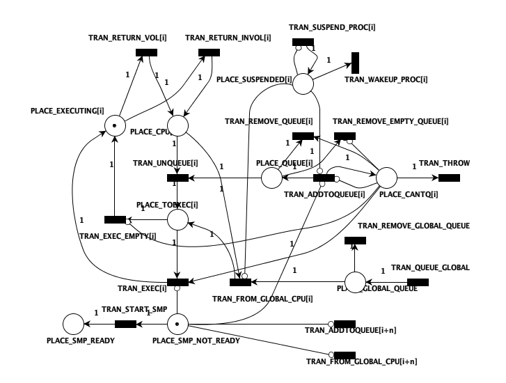

# Iteración 1

> Suspender un procesador

## Objetivos a alcanzar

- Inhibir la transición de encolado del CPU y la transición de desencolado de la cola global
- Permitir que el procesador termine de ejecutar todos los hilos en su cola
- Poder habilitar nuevamente el procesador

## Modelo propuesto



## Análisis del modelo

Se piensa como un módulo aparte (no relacionado íntimamente con los estados de la CPU). Éste módulo permitiría al procesador terminar con todos los hilos que estén en su cola, y luego se bloquearía. Para que el procesador pueda volver a ejecutar, se debe desbloquear el módulo ejecutando la transición que elimina el token de la plaza `Suspendido`.
El bloqueo consiste en inhibir la transición de encolado del CPU y la transición de desencolado de la cola global.

## Validación del modelo

-- [Agregar validación con PIPE] --

## Implementación del modelo

Para implementar el modelo en el código fuente, se procedió a

- Definir en `sched_petri.h` las plazas y transiciones correspondientes al módulo de suspensión.

  ```h
  #define CPU_NUMBER 4
  // FOR GLOBAL TRANISTIONS
  #define CPU_BASE_PLACES 6
  #define CPU_BASE_TRANSITIONS 11
  #define CPU_NUMBER_PLACES (CPU_BASE_PLACES*CPU_NUMBER)+3
  #define CPU_NUMBER_TRANSITION (CPU_BASE_TRANSITIONS*CPU_NUMBER)+4
  /* Definitions of transition and places for the CPU resource net */
  //PLACES
  #define PLACE_CANTQ 0
  #define PLACE_QUEUE 1
  #define PLACE_CPU 2
  #define PLACE_TOEXEC 3
  #define PLACE_EXECUTING 4
  #define PLACE_SUSPENDED 5

  //TRANSITION
  #define TRAN_ADDTOQUEUE 0
  #define TRAN_UNQUEUE 1
  #define TRAN_EXEC 2
  #define TRAN_EXEC_EMPTY 3
  #define TRAN_RETURN_VOL 4
  #define TRAN_RETURN_INVOL 5
  #define TRAN_FROM_GLOBAL_CPU 6
  #define TRAN_REMOVE_QUEUE 7
  #define TRAN_REMOVE_EMPTY_QUEUE 8
  #define TRAN_SUSPEND_PROC 9
  #define TRAN_WAKEUP_PROC 10
  ```

- Dentro del archivo `petri_global_net.c`
  - Actualizar las matrices
    - `base_resource_matrix`
    - `base_resource_inhibition_matrix`
  - Verificar que se inicialicen correctamente las matrices correspondientes dentro de `init_resource_net()`
  - Actualizar la variable `transitions_names`

Rama asociada a la iteración
`DrudiGoldmanPI/feature_iteration_1`

## Análisis de resultados

## Próximos pasos
