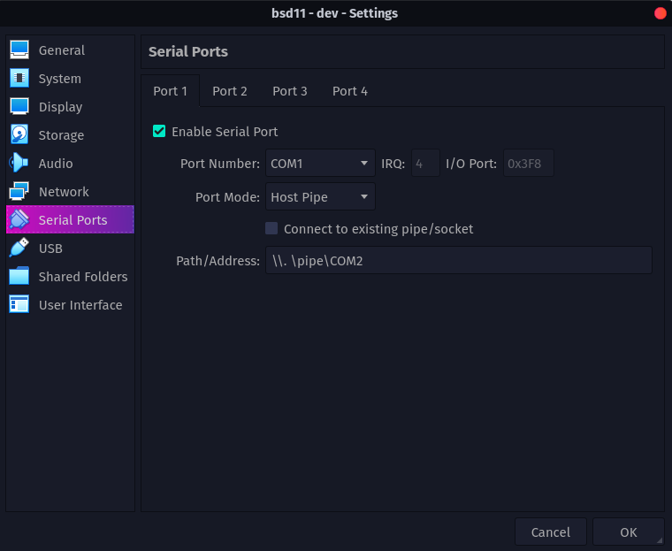
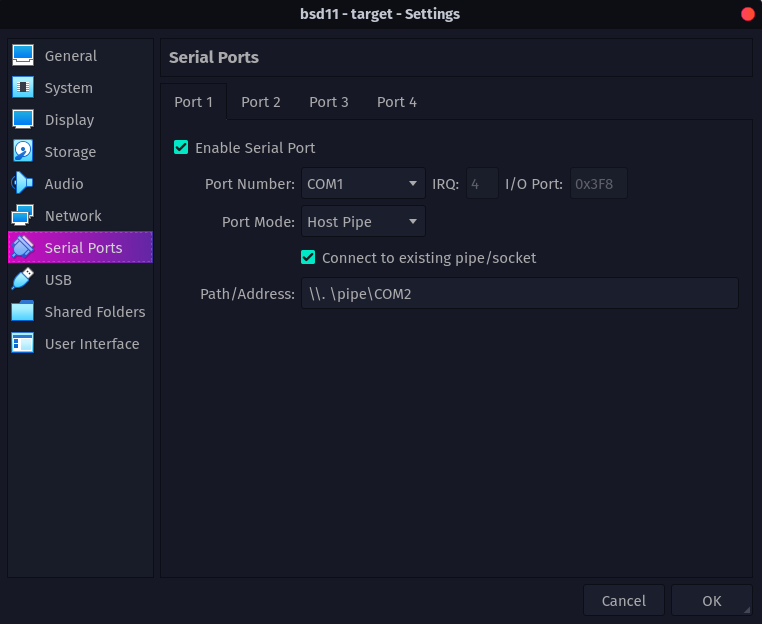

# Debug de FreeBSD Kernel entre dos máquinas virtuales (debug remoto)

1.  Definir dos maquinas virtuales, **"Dev"** (se usará para correr kgdb) y **"Target"** (es la que será debuggeada)

2.  Una de las máquinas virtuales creará un pipe de conexión (**Dev**) y la otra se conectará al mismo. **Siempre encender primero la máquina que crea el pipe.**

3.  Configurar las máquinas virtuales de la siguiente forma:

    ## Dev

    

    ## Target

    

    > En caso de que no sea posible la conexión con la dirección de pipe propuesta (generalmente en Mac), es posible utilizar la siguiente: `/tmp/serial`

4.  Para realizar una prueba del puerto serial entre ambas máquinas se deben encender las dos máquinas virtuales y en **Target** escribir el siguiente comando para comenzar a ver los comandos enviados por la otra máquina

    ```bash
    cat /dev/cuau0
    ```

    Luego en la máquina **Dev** ejecutar el siguiente comando para enviar un texto de prueba:

    ```bash
    echo "Test String" >> /dev/cuau0
    ```

    Si la conexión fue exitosa, se debería ver el texto enviado por la máquina **Dev** en la máquina **Target**

5.  En **Target** editar el archivo ubicado en `/boot/device.hints` para
    que se encuentre la siguiente línea

    ```bash
    hint.uart.0.flags="0x80"
    ```

    **Luego de editar el archivo, reiniciar la máquina**

6.  Ejecutar los siguientes comandos en la máquina **Dev**

    ```bash
    cd /usr/obj/usr/src/sys/[KERNEL_CONFIG_FILE_NAME]

    make gdbinit

    kgdb -r /dev/cuau0 ./kernel.debug
    ```

7.  En este punto se puede comprobar dentro de **Target** que el backend de GDB se encuentra disponible a través del siguiente comando:

    ```bash
    sysctl debug.kdb.available
    ```

    Se debería obtener como respuesta lo siguiente:

    `debug.kdb.available: ddb gdb`

8.  En **Target** ingresar al backend de GDB dentro del modo debugger mediante:

    ```bash
    sysctl debug.kdb.enter=1

    db> gdb
    ```

9.  Para debuggear desde la máquina **Dev**, utilizar:
    - n(next)
    - s(step)
    - bt(break)
    - c(continue

---

## Comandos útiles a la hora de debuggear:

| Comando       | Explicación                                                                   |
| ------------- | ----------------------------------------------------------------------------- |
| break {where} | Agrega un breakpoint, puede ser un nombre de método, o una línea de archivo   |
| continue      | Continúa la ejecución hasta el próximo breakpoint                             |
| next          | Ejecuta la línea actual (Mismo nivel de produnidad)                           |
| step          | Ejecuta la línea actual ingresando al método que se está convocando (Step-in) |
| info locals   | Imprime variables locales                                                     |
| print \*dato  | Imprimir estructuras de datos                                                 |
| frame         | Te dice donde estas parado en el programa (Stack Frame)                       |

---

## Documentación

- [FreeBSD kernel debugging][freebsd kernel debugging]
- [Compile FreeBSD kernel in debugging mode][compile freebsd kernel]

<!-- Global variables -->

[freebsd kernel debugging]: http://chetanbl.blogspot.com/2011/11/freebsd-kernel-module-debugging.html
[compile freebsd kernel]: https://github.com/nicolaspapp/freebsd/wiki/Compilaci%C3%B3n-del-Kernel-de-FreeBSD-en-modo-Debug
