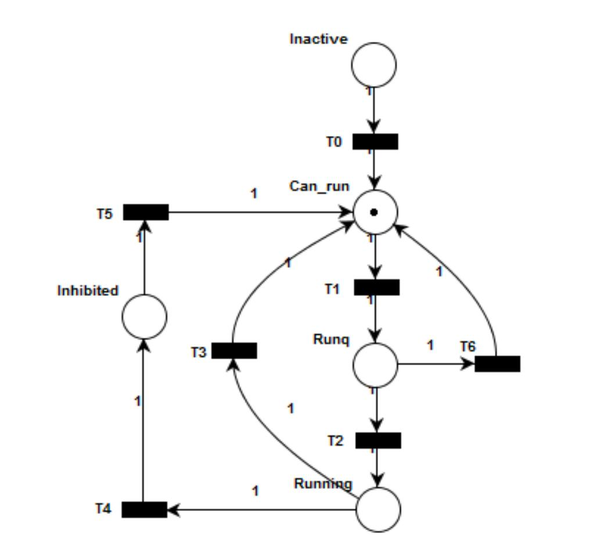
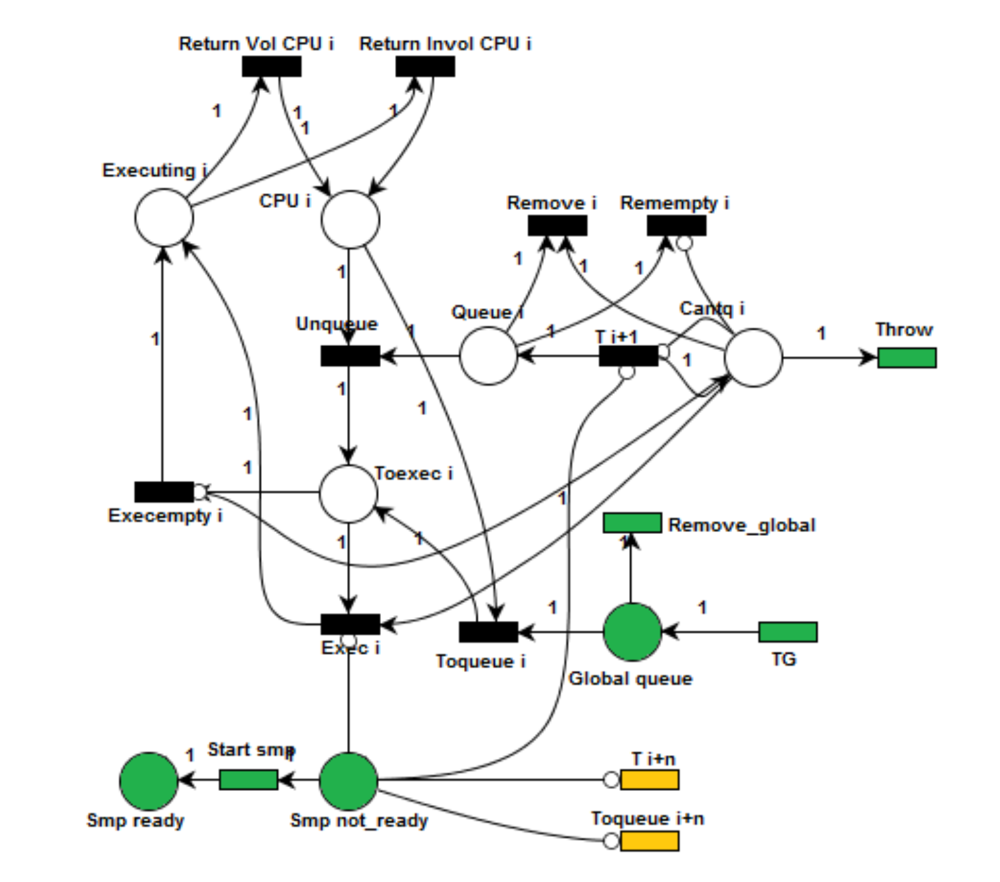

# Tests

Procedimientos y métodos para verificar que lo implementado en el proyecto final anterior, sigue siendo válido en cualquier versión a la que se quiera migrar.

Para poder desarrollar los procedimientos es necesario conocer la estructura de las redes de petri de los casos sobre los que se ejecutarán las pruebas.

### Modelado de un hilo

### Modelado de un recurso (CPU)

Correspondencia entre el nombre de las plazas del modelo con el nombre de las plazas en el código

| Modelo    | Código          |
| --------- | --------------- |
| Cantq     | PLACE_CANTQ     |
| Queue     | PLACE_QUEUE     |
| CPU       | PLACE_CPU       |
| Toexec    | PLACE_TOEXEC    |
| Executing | PLACE_EXECUTING |

## Invariantes de recursos

- La plaza CPU nunca puede contener mas de dos tokens
- La suma de los tokens de las plazas relacionadas al modelado del CPU no puede ser mayor que uno

## Plazas

| Código              | index PROC0 | index PROC1 | index PROC2 | index PROC3 | index |
| ------------------- | :---------: | :---------: | :---------: | :---------: | :---: |
| PLACE_CANTQ         |      0      |      5      |     10      |     15      |       |
| PLACE_QUEUE         |      1      |      6      |     11      |     16      |       |
| PLACE_CPU           |      2      |      7      |     12      |     17      |       |
| PLACE_TOEXEC        |      3      |      8      |     13      |     18      |       |
| PLACE_EXECUTING     |      4      |      9      |     14      |     19      |       |
|                     |             |             |             |             |       |
| PLACE_GLOBAL_QUEUE  |             |             |             |             |  20   |
| PLACE_SMP_NOT_READY |             |             |             |             |  21   |
| PLACE_SMP_READY     |             |             |             |             |  22   |

## Transiciones

| Código                   | index PROC0 | index PROC1 | index PROC2 | index PROC3 | index |
| ------------------------ | :---------: | :---------: | :---------: | :---------: | :---: |
| TRAN_ADDTOQUEUE          |      0      |      9      |     18      |     27      |       |
| TRAN_UNQUEUE             |      1      |     10      |     19      |     28      |       |
| TRAN_EXEC                |      2      |     11      |     20      |     29      |       |
| TRAN_EXEC_EMPTY          |      3      |     12      |     21      |     30      |       |
| TRAN_RETURN_VOL          |      4      |     13      |     22      |     31      |       |
| TRAN_RETURN_INVOL        |      5      |     14      |     23      |     32      |       |
| TRAN_FROM_GLOBAL_CPU     |      6      |     15      |     24      |     33      |       |
| TRAN_REMOVE_QUEUE        |      7      |     16      |     25      |     34      |       |
| TRAN_REMOVE_EMPTY_QUEUE  |      8      |     17      |     26      |     35      |       |
|                          |             |             |             |             |       |
| TRAN_REMOVE_GLOBAL_QUEUE |             |             |             |             |  36   |
| TRAN_START_SMP           |             |             |             |             |  37   |
| TRAN_THROW               |             |             |             |             |  38   |
| TRAN_QUEUE_GLOBAL        |             |             |             |             |  39   |
